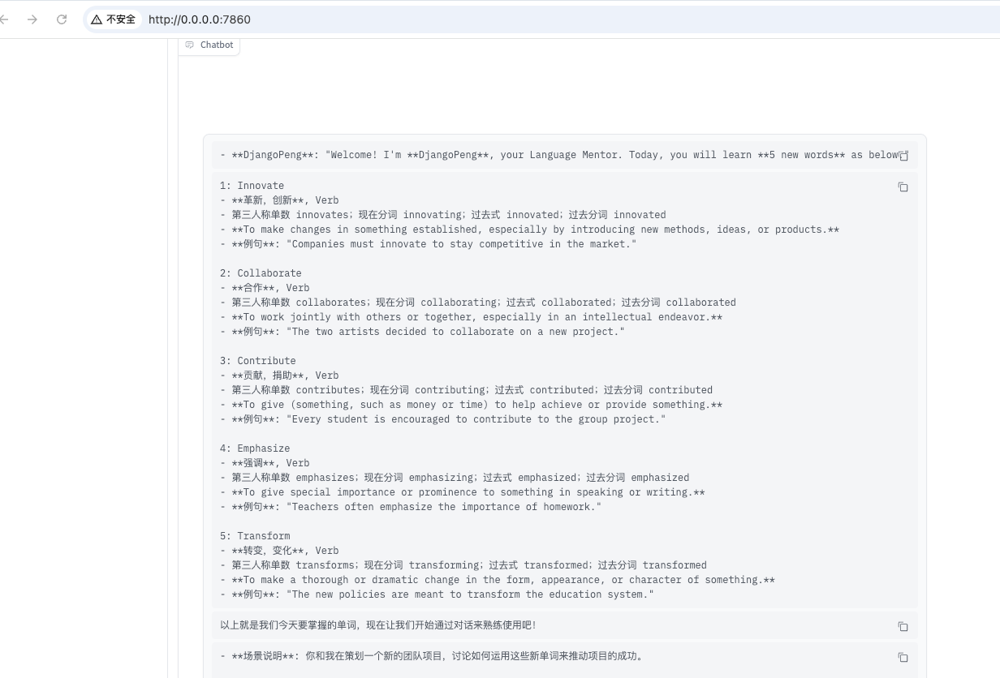
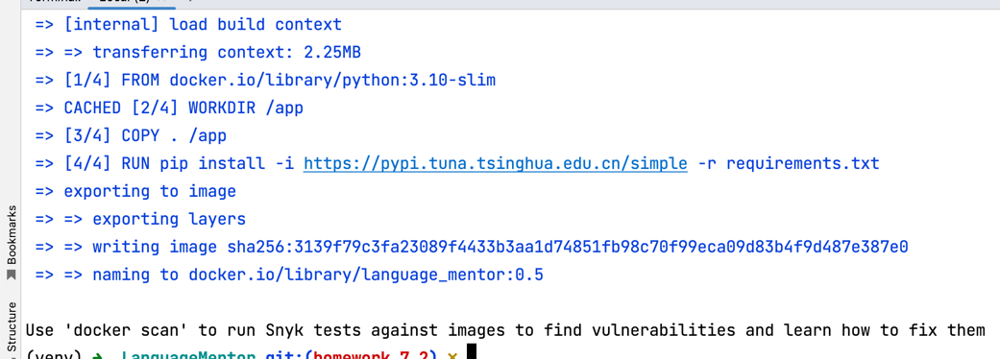
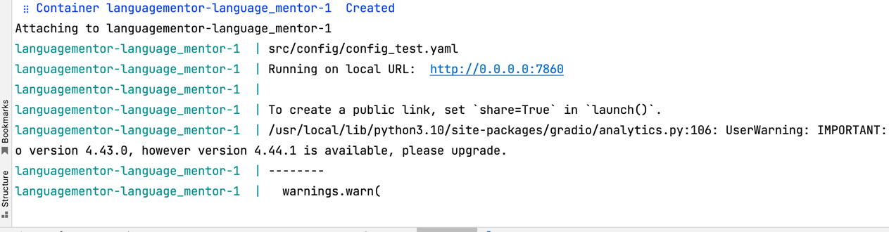
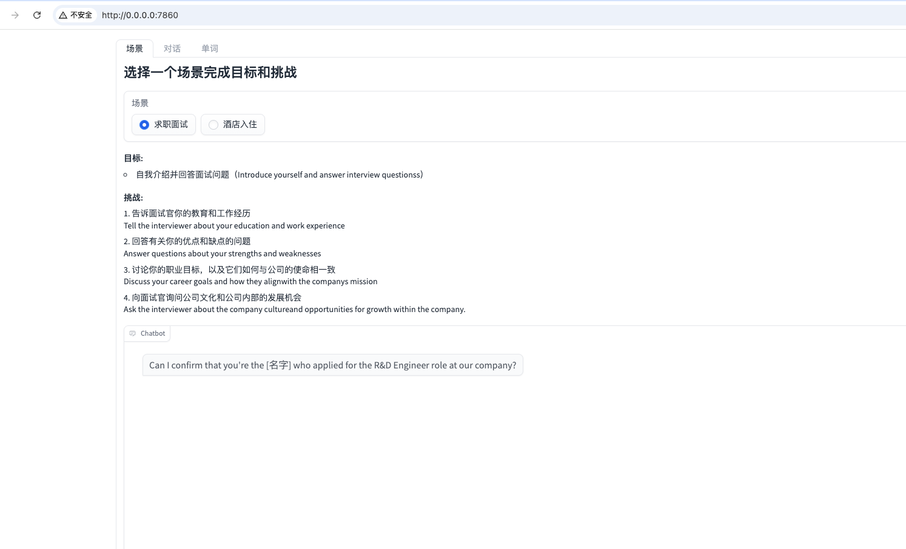

# 作业链接
https://u.geekbang.org/review/detail/1129822?lesson=656&article=813088&page=1&size=20&status=1

# 作业内容
题目描述

- 参考 《GitHubSentinel 高级功能与生产级发布》 章节，在 Language Mentor v0.4 基础上实现：
  - 新增单元测试（覆盖率 80%）与自动化测试脚本；
  - 新增 Dockerfile，实现镜像构建与容器化部署；
- （可选）将 LanguageMentor 发布到 HuggingFace Space，便于学术交流和分享。


# 作业处理
## 1. 新增单元测试（覆盖率 80%）与自动化测试脚本
这部分不做赘述, 可以参考别的项目的单元测试脚本
核心在于新建 test 文件夹, 然后在里面编写测试脚本, 用于测试项目的各个功能模块

## 2. 新增 Dockerfile，实现镜像构建与容器化部署
由于不一定所有人都拥有GPU和服务器, 因此这里选择更通用的方式
使用openai的代理环境来配置. 因此需要修改, 新增一个Config的外部挂载模块. 用于配置代理环境
因此本程序新增了src/config/config.py模块来进行动态的做一些配置. 例如代理环境的配置

到这一步修改完之后就能通过如下启动
```bash
python src/main.py
```

启动截图:


### 依赖
- Docker
- Dockerfile
- Docker-compose

### 案例
1. 部署docker
参考官方部署方式
https://www.docker.com/
安装完毕之后必须启动才能执行步骤2

2. 新建 Dockerfile
在跟目录下创建 Dockerfile 文件, 内容如下
```Dockerfile
# 使用官方 Python 运行时作为父镜像
FROM python:3.10-slim
# 设置工作目录
WORKDIR /app
# 复制项目文件到工作目录
COPY . /app
# 安装项目依赖, 使用清华源更快点.
RUN pip install -i https://pypi.tuna.tsinghua.edu.cn/simple -r requirements.txt
# 设置环境变量
ENV PYTHONUNBUFFERED=1

# 执行单测
# RUN python -m unittest discover -s src/test -p "*_test.py"

# 暴露应用端口, 这是默认的gradio的端口
EXPOSE 7860
# 运行应用
CMD ["python", "src/main.py"]

```

3. 构建镜像
```bash
# 根据需要修改你的version, 比如这里是0.5
version=0.5
docker build -t language_mentor:${version} -f Dockerfile .
```
执行打包镜像后如下


4. 编写docker-compose.yml
由于我们希望能够动态的配置一些代理环境, 以及当prompt等配置不够合理时, 能及时调整, 
因此这部分数据内容是必须要挂在到外部的, 以便于我们能够动态的调整
```yml
version: '3'
services:
  language_mentor:
    image: language_mentor:0.5
    ports:
      - "7860:7860"
    volumes:
      # llm文件挂在
      - ./src/config/config.yaml:/app/src/config/config.yaml:ro
      # prompt文件挂载
      - ./src/config/prompts:/app/src/config/prompts:ro 
    
    # 跑应用
    command: python src/main.py

```

5. 修改启动前配置
根据需要修改你的启动配置 src/config/config.yaml 和 src/config/prompts
eg:
src/config/config.yaml
诸如下述是代理配置方案. 使用openai/gpt-4o-mini模型
```
llm:
  llm_type: openai
  model: gpt-4o-mini
  max_tokens: 8192
  temperature: 0.8
  api_key: "你的代理sk"
  base_url: "https://转发代理域名/v1"
```
6. 启动
```bash
docker-compose -f docker-compose.yml up
# 如果要后台启动, 追加 -d 参数
```

启动截图:


外部效果:
