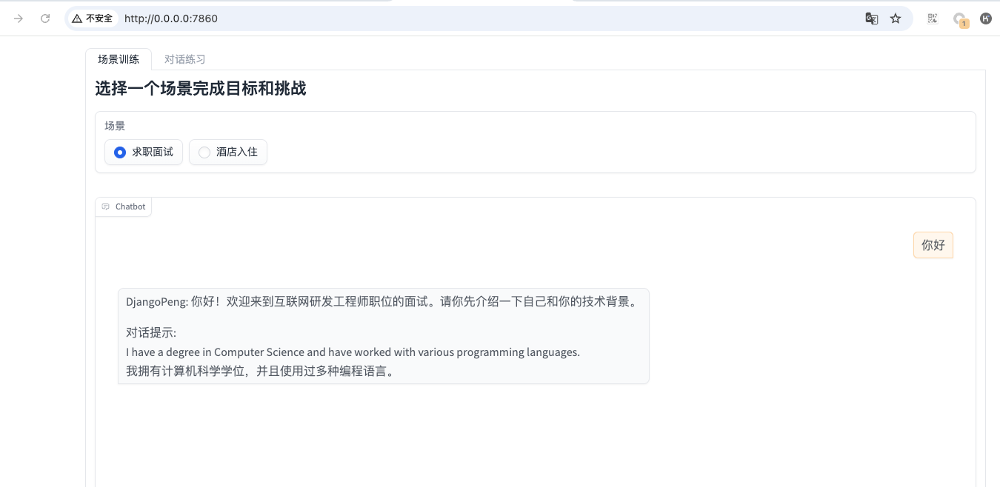

# 作业链接
https://u.geekbang.org/lesson/656?article=812357

# 作业要求
1. 学习《场景化 System Prompt 设计》中与 ChatGPT 4o 的聊天记录，设计并实现 2 个新场景。关于场景选择的说明：
- 场景 1：薪酬谈判或租房；
- 场景 2：自定义一个日常的生活或工作场景，如：单位请假、机场托运。
2.（可选）在 v0.3 基础上新增配置管理功能，支持配置不同的大模型来驱动 LanguageMentor。

# 作业解析

## 2. 可选作业：新增配置管理功能
### 解析
通过增加config.py的功能来具体的实现配置管理功能，可以通过配置文件来选择不同的大模型来驱动LanguageMentor。


```python
import yaml


class Config(object):
    SUPPORT_LLM_TYPE_OLLAMA = "ollama"
    SUPPORT_LLM_TYPE_OPENAI = "openai"
    SUPPORT_LLM_TYPES = [SUPPORT_LLM_TYPE_OLLAMA, SUPPORT_LLM_TYPE_OPENAI]

    def __init__(self, config_file: str):
        self.config = self.load_config(config_file)

    def load_config(self, file_path):
        print(file_path)
        with open(file_path, 'r', encoding='utf-8') as file:
            cfg = yaml.safe_load(file)
        return cfg

    def get_llm_config(self):
        llm_config = self.config['llm']
        llm_types = self.SUPPORT_LLM_TYPES
        llm_type = llm_config.get("llm_type", "ollama")
        if llm_type not in llm_types:
            raise ValueError(f"llm_type must be one of {llm_types}")
        return {
            "llm_type": llm_type,  # 支持配置参数, llm_type
            "model": llm_config.get("model", "llama3.1:8b-instruct-q8_0"),  # 支持配置参数, model
            "max_tokens": llm_config.get("max_tokens", 8192),  # 支持配置参数, max_tokens
            "temperature": llm_config.get("temperature", 0.8),  # 支持配置参数, temperature
            "api_key": llm_config.get("api_key", None),  # 支持配置参数, api_key
            "base_url": llm_config.get("base_url", None)  # 支持配置参数, base_url
        }


if __name__ == '__main__':
    cfg_client = Config('config.yaml')
    print(cfg_client.config)

```

yaml配置为:
```yaml
# config.yaml

llm:
  llm_type: ollama
  model: llama3.1:8b-instruct-q8_0
  max_tokens: 8192
  temperature: 0.8
  api_key: null
  base_url: null
```

变更追加llm申请
```python
from langchain_ollama.chat_models import ChatOllama  # 导入 ChatOllama 模型
from langchain_openai import ChatOpenAI
from config.config import Config # 导入配置类


def llm_gen(config_client: Config):
    llm_type = config_client.get_llm_config()["llm_type"]
    # 初始化 ChatOllama 模型，配置模型参数
    if llm_type not in Config.SUPPORT_LLM_TYPES:
        raise ValueError(f"llm_type must be one of {Config.SUPPORT_LLM_TYPES}")

    llm_config = config_client.get_llm_config()

    if llm_type == Config.SUPPORT_LLM_TYPE_OPENAI:
        return gen_openai_llm(**llm_config)

    if llm_type == Config.SUPPORT_LLM_TYPE_OLLAMA:
        return gen_ollama_llm(**llm_config)

    raise ValueError(f"llm_type must be one of {Config.SUPPORT_LLM_TYPES}")


def gen_openai_llm(model, max_tokens, temperature, api_key, base_url, **kwargs):
    return ChatOpenAI(
        model=model,  # 使用的模型名称
        max_tokens=max_tokens,  # 最大生成的token数
        temperature=temperature,  # 生成文本的随机性
        api_key=api_key,
        base_url=base_url
    )


def gen_ollama_llm(model, max_tokens, temperature, **kwargs):
    return ChatOllama(
        model=model,  # 使用的模型名称
        max_tokens=max_tokens,  # 最大生成的token数
        temperature=temperature,  # 生成文本的随机性
    )

```
运行结果
